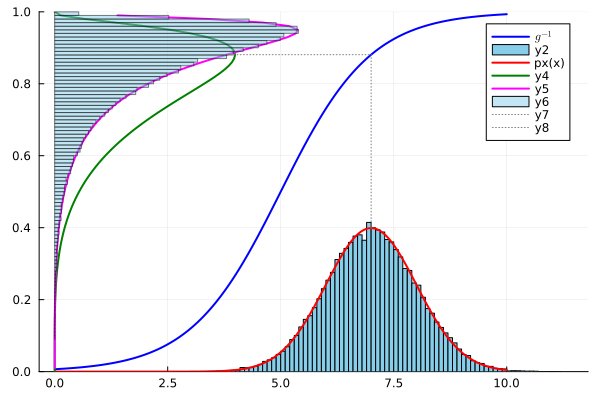

# DeepLearningBishopFigures

This repository contains my self-driven project to study and reproduce key examples from **Christopher Bishop’s *Deep Learning Foundations and Concepts***. You can find the book on [this](https://www.bishopbook.com/) website for free to read. The goal of this project is to deepen understanding of fundamental deep learning concepts by implementing them in Pluto.jl/Jupyter notebooks and visualize results for better intuition.

## Overview

During this project, I focused on reproducing several core examples from Bishop’s book:

* **Polynomial regression example**: In the book's opening chapter, section `1.2` introduced a tutorial example which explains many basic concepts of machine learning intuitively. I had reproduced and confirmed the results that was shown in this section.
* **Density transformations**: In the book's second chapter on probabilities, section `2.4` Transformation of Densities outlines the interesting properties of probability density functions (PDFs) under a nonlinear change of variable.
* **Bias of maximum likelihood**: In the book's section `2.3.3` and `Figure 2.10` discusses how bias arises when using maximum likelihood to determine the mean and the variance of a Gaussian distribution. I found this section to be an excellent example to convert into `Pluto.jl` notebook, where interactivity of `Sliders` showcased intricate properties visually.

## Notebooks

- `Chap2-Transformation-Densities.ipynb` - PDF under a change of variable doesn't always transform as if it were just a function. Because transformed pdf must sum to one, the Jacobian of the transformation must be multiplied with transformed pdf. This example illustrates that mode (i.e maximum) of Gaussian pdf, denoted by $\hat{x}$ doesn't map to corresponding $\hat{y} = g^{-1}(\hat{x})$, where $g^{-1}$ denotes inverse nonlinear change of variable.

- `sin_func_interpolation.jl` - A [Pluto.jl](https://plutojl.org/) notebook attempting to reproduce a **Tutorial Example** Section `1.2` from the book.

- `probabilities-chap2.jl` - Also a Pluto notebook demonstrating how bias occurs when you calculate sample variance using the sample mean. It's discussed in Chapter 2, Section `2.3.3` **Bias of maximum likelihood**. As shown in the gif below, if the number of data points is low (equals 2) then the variance is off by a huge amount. The blue bell shaped curve is quite narrow. But as number of data points increase, this effect is less pronounced. Mathematically:

$$ E[\sigma^2_{ML}] = (\frac{N - 1}{N})\sigma^2 $$

As you can see from the equation above, when N=2, then maximum likelihood variance is off from the real variance by a factor of 1/2! But as $N -> \infty$ then this effect is not noticable. And to make the variance unbiased we use `1/(N-1)` instead of `1/N` and it's called **Bessel correction**.

## Setup and Running
- For the `Pluto.jl` notebooks and installing, please visit excellent instructions on their [website](https://plutojl.org/#install).
- For the Jupyter notebooks there are two options. If you want to open them in Colab, please remember to change the runtime to Julia.
- Otherwise, to run Jupyter locally with Julia kernel, please visit the `IJulia` documentation [here](https://julialang.github.io/IJulia.jl/stable/manual/installation/).

